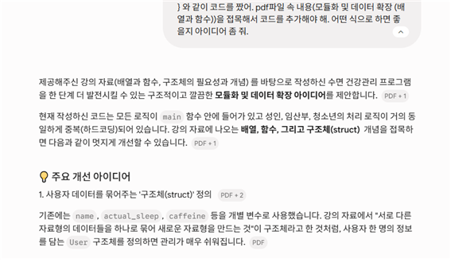
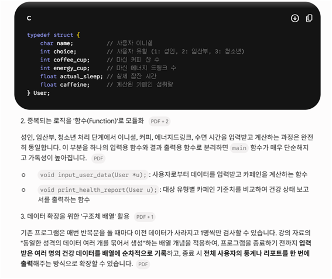
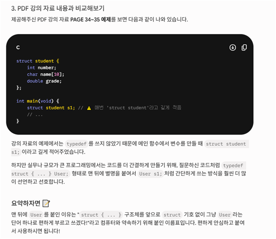
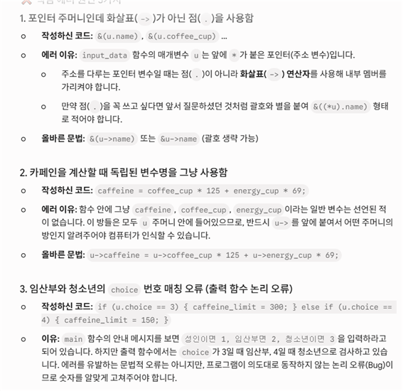
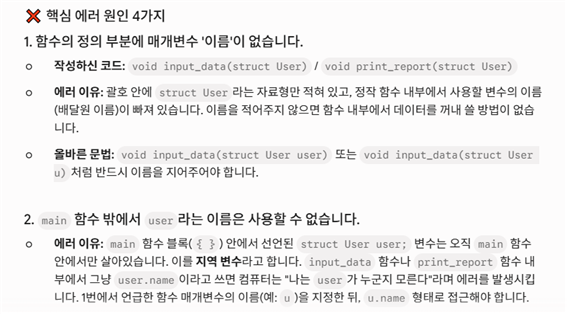
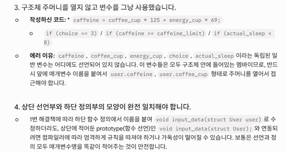
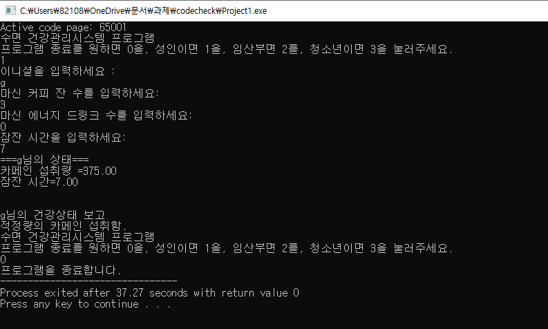

# 💻 [2026-01] 나만의 C언어 소프트웨어 개발 프로젝트

## 1. 시나리오 제목
* 나만의 카페인 및 수면 관리 프로그램

 

## 2. 시나리오 (5~10줄)
* 이 프로그램은 커피 섭취량과 수면시간을 입력받아 건강상태를 분석하고 알려주는 <b>'건강 관리 시스템'</b>입니다.
* 사용자는 수면시간 및 커피 섭취량 등을 입력합니다. 시스템은 이를 바탕으로 카페인 함량을 계산하고, 카페인 함량과 수면시간에 따라 사용자의 건강상태를 알려줍니다. 또한, 복합적인 조건(예: 특정 섭취량 이상이면서 수면시간이 수치 이하인 경우)을 만족하면 '수면부족심각'이나 '면역력 및 기억력 악화'를 표시하는 특별 관리 로직이 포함됩니다. 최종적으로는 사용자가 프로그램을 통해 자신의 건강 상태를 알고,  동시에 관리하며 건강과 수면생활이 원할할 수 있도록 전체 시스템을 완성할 계획입니다.  

 

## 3. 예상 기능 및 메뉴 (최소 5개)
1. 사용자 이름 입력
2. 마신 커피 및 에너지 드링크 수
4. 수면 시간
5. 커피 및 에너지 드링크 속 카페인 함량 계산
6. 사용자 건강 상태 출력
0. 프로그램 종료

 

---

# 🚀 [버전별 개발 일지 & AI 협업 기록]

## 🟦 [1차 과제: V1.0] 기초 뼈대 구축 (입출력과 변수)
### **✨V1.0 개발 내용:**
  * 사용자로부터 이름(이니셜), 마신 커피 수, 마신 에너지 드링크 수, 수면시간을 입력받아 종합적인 건상상태를 계산하여 출력합니다.
  * 캐릭터의 이니셜(문자), 마신 커피 수/마신 에너지 드링크 수(정수), 수면시간(실수)를 입력받는 화면을 구현했습니다.
  * 사칙연산을 활용해 '카페인 함량'을 계산하여 출력했습니다.
    
### **🤖 AI 파트너십 과정**
 1. **내용 1**
    * **프롬프트 요약:** "C언어 4단계 과제 로드맵(입출력 ➔ 조건문 ➔ 반복문 ➔ 배열/함수)로 발전시킬 콘솔프로그램을 만들어야 함"
    * **적용 내용:** 프롬프트를 참고하여 주제 및 아이디어를 선정할 수 있었다. 
      
 2. **내용 2**
    * **프롬프트 요약:** "변수 5개를 충족하기 위한 구조 모델링 논의"
    * **적용 내용:** 여러 데이터를 제공해주고 그에 맞춰 문자형(`char` - 이름), 정수형(`int` - 커피 섭취 수), 실수형(`float` - 수면시간)으로 자료형을 명확히 분리하여 입력 데이터의 구조적 완성도를 높임.
    
### **🛠️ Troubleshooting & 기술 회고:**
  1. **문제 1:** 몸무게에 따른 카페인 섭취량을 계산하려 했지만, 몸무게 변수에 곱셈이 되지 않았다.
     * **해결:** 몸무게에 따른 카페인 섭취량에 관한 자료는 성인에 관해서는 잘 안나와 있어서 제외하기로 했다. 
  2. **문제 2:** 순차적으로 메세지가 나오도록 해야 하는데 이름을 입력하고나면 나머지 행의 수식이 한꺼번에 출력된다.
     * **해결:** 이름을 문자가 아닌 문자열로 저장되도록 %c에서 %s로 수식을 바꿨다. 
  3. **문제 3:** (추가로 발생한 문제와 해결 과정을 객관적으로 자유롭게 기록하세요.)
     
### **📁 증빙 자료:**
  * [1차_AI협업캡처.pdf 첨부 완료] (첨부 후 링크)[1차 ai협업캡쳐.pdf](https://github.com/user-attachments/files/26486297/1.ai.pdf)

  * [1차과제_실행결과.jpg]

 

## 🟩 [2차 과제: V2.0] 조건 분기 적용 (조건문) - 향후 작성 예정
### **✨2차 과제 업데이트 내용:**
  * 내용. 카페인과 에너지 드링크 음료를 마신 수에 따라서 상태를 알려주도록 조건문을 작성하였다.
    
### **🤖 AI 파트너십 과정**
 1. **내용 1**
    * **프롬프트 요약:**  ... 
    * **적용 내용:** ....
    
### **🛠️ Troubleshooting & 기술 회고:**
  1. **문제 1:** ...
     * **해결:** ...
     
### **📁 증빙 자료:**
  * [2차_AI협업캡처.pdf 첨부 완료] (첨부 후 링크)
  * [2차과제_실행결과.jpg]

 

## 🟨 [3차 과제: V3.0] 무한 루프와 메뉴 시스템 (반복문) - 향후 작성 예정
### **✨3차 과제 업데이트 내용:**
  * 내용. 메뉴를 선택하여 해당하는 정보를 얻을 수 있도록 하였습니다. (성인,청소년,임산부의 경우를 따로따로 알 수 있도록.)
    
### **🤖 AI 파트너십 과정**
  1. **내용 1**
    * **프롬프트 요약:**  ... 
    * **적용 내용:** ....
     
### **🛠️ Troubleshooting & 기술 회고:**
  1. **문제 1:** ... 이니셜을 입력해야 하는데 다음 입력메세지가 바로 나옴.
     * **해결:** ... scanf함수 사용시 엔터키를 넣어 해결하였습니다. -> (" %c")
  2. **문제 2:** ... while 문을 통해 메뉴를 만들었으나 한 번 실행을 시키면 종료가 안 되고 계속 입력메세지가 뜸.
     * **해결:** ... while 문 안에 메뉴 메세지를 넣어 종료 입력을 받도록 하였음.
  3. **문제 3:** ... 깃허브 내에서 조작하고 수정한 코드가 실행이 안됨.
     * **해결:** ... 따로 dev c 프로그램을 열어 수정한 것을 복사하여 오류를 검출할 수 있도록 함.
    
### **📁 증빙 자료:**
  * [3차_AI협업캡처.pdf 첨부 완료] (첨부 후 링크)
  * [3차과제_실행결과.jpg] 

 

### 🟥 [4차 과제: V4.0] 모듈화 및 데이터 확장 (배열과 함수) - 🌟최종 완성 -- 향후 작성 예정
### **✨4차 과제 업데이트 내용:**
  * 내용. 반복되는 내용을 구조체와 함수를 사용하여 크기를 줄임
    
### **🤖 AI 파트너십 과정**
 1. **내용 1**
    * **프롬프트 요약:**  어떻게 코드를 추가하고 바꿔야 하는지에 대한 아이디어를 물었다.
    * **적용 내용:** 구조체와 함수를 사용해서 크기를 줄이는 방법을 제안 받았다.

 2. **내용 2**
    * **프롬프트 요약:**  구조체로 반복되는 내용을 줄이는 과정에서 에러가 발생.
    * **적용 내용:** 실제 내용이 틀린 부분과 변수를 그대로 사용하지 않도록 조치했다.

    
### **🛠️ Troubleshooting & 기술 회고:**
  1. **문제 1:** 구조체 적용 과정에서 계속해서 에러가 발생
     * **해결:** ai를 활용하여 에러 해결
     
### **📁 증빙 자료:**
  * [4차_AI협업캡처.pdf 첨부 완료] (첨부 후 링크),,,,,
  * [4차과제_실행결과.jpg]
 
